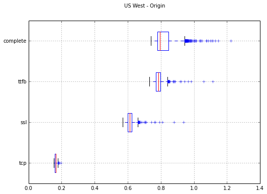
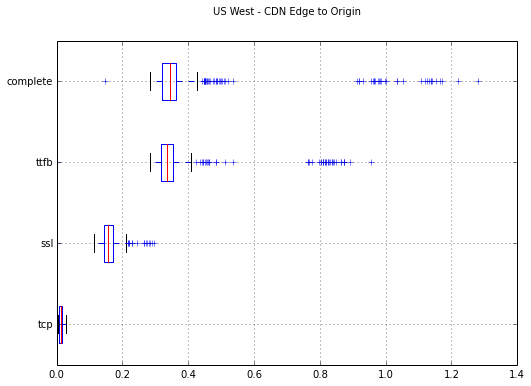
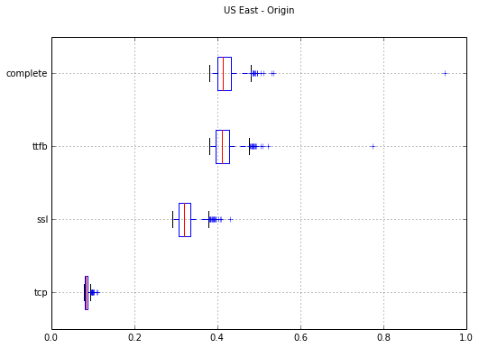
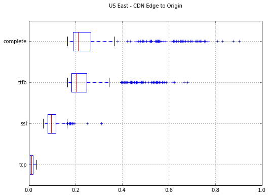

## Motivation

A number of high volume sites have, through experimentation asserted that latency has a major impact on their bottom line.

- Amazon found that for every 100ms of latency it cost them 1% in sales.
- Google found that a .5s increase in user perceived latency (400ms to 900ms) reduced traffic by 20%.

The aim of this experiment is to identify how much impact a CDN would have on the performance of dynamic requests to our origin's web services. Given a CDN's job is accelerated caching it is assumed that static requests would be improved significantly and as a result were excluded from this test.

## Results

Comparing our current solution of direct to origin vs the proposed CDN accelerated SSL termination the following timings (in seconds) were discovered for the completion of a new request;

| Desc         | Median | 75th PCTL | Max   |
| ------------ | ------:| ---------:| -----:|
| USW - Direct |  0.795 |     0.844 |  1.22 |
| USW - CDN    |  0.343 |     0.364 |  1.28 |
| USE - Direct |  0.413 |     0.432 | 0.947 |
| USE - CDN    |  0.212 |     0.265 | 0.902 |

## Pricing

For 1TB and 2,000,000 file requests it will cost approximately 120USD/mth for HTTP traffic. The addition of HTTPS is likely to incur a relatively significant upfront cost and recurring fee as follows (all prices in USD) but can be negotiated with Fastly's sales team:

| Desc                                 | Setup | Add-Change-Remove | Recurring        |
| ------------------------------------ | -----:| -----------------:| ---------------- |
| Shared Certificate Service           |   500 |               500 | 100/domain       |
| Shared Wildcard Certificate Service  |   500 |               500 | 275/wildcard     |
| Customer Certificate Hosting Service |  2000 |              1200 | 1500/certificate |

## Method

Fastly was chosen as a CDN provider for testing as it has a reasonable pricing model, highly configurable via Varnishes VCL syntax, has a number of global PoP, is PCI Compliant, and is the CDN used by the UK's Government Data Services (e.g. gov.uk). Akamai was discounted as it is expensive, cumbersome, does not have direct sign-up, and from my experience requires a consulting for many elements of configuration.

The following URL's were used for testing;

- direct origin https://broker.markelinternational.com/ca/en/home
- cdn edge https://markelbroker.global.ssl.fastly.net/ca/en/home

Caching was disabled in the CDN to simulate dynamic request acceleration to the origin. HTTP keep-alive was disabled in the client request to ensure the full TLS handshake was initiated on each request. For the CDN configuration the connectivity looks as follows:

```client <=[HTTPS]=> edge <=[HTTPS]=> origin```


1000 requests were made against each URL with a 1s sleep from an EC2 instance located in California using the following script;

<pre><code>
#!/bin/sh
for i in `seq 1 1000`; do
  curl --no-keepalive -w "tcp: %{time_connect} ssl: %{time_appconnect} ttfb: %{time_starttransfer} complete: %{time_total}\n" -sk -o /dev/null ${URL}
  sleep 1
done
</code></pre>

## Additional Benefits

- High availabilty of static site elements.
- Potential DDoS mitigation.
- Acceleration of static elements.

## Detailed Performance Analysis

The boxplots and line plots below clearly illustrate that across all aspects of the request cycle the CDN provides an optimised experience.

### US West



## US East



